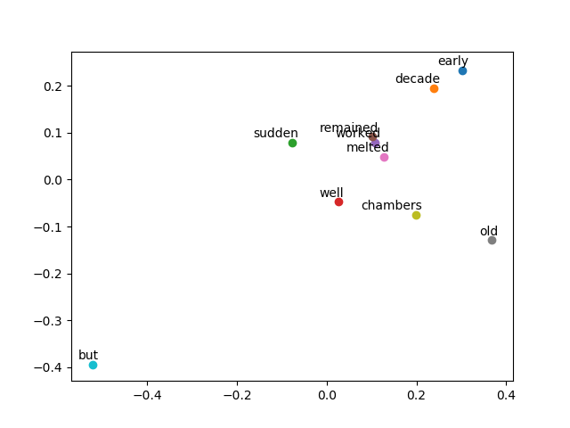

# Torch Glove

A simple PyTorch implementation of the [GLoVe paper](http://nlp.stanford.edu/pubs/glove.pdf).



## Requirements

This project was built with Python 3.6, PyTorch, and NLTK. Matplotlib was used for visualization.

## Running the Project

The GLoVe model can be trained with:

```python
python3 glove.py
```
